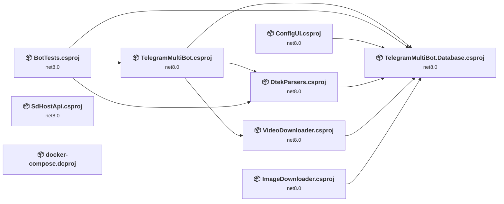
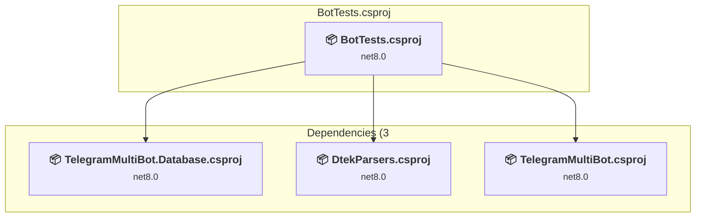
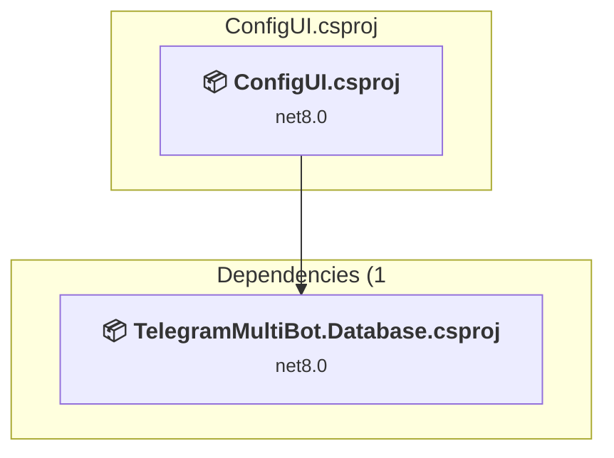
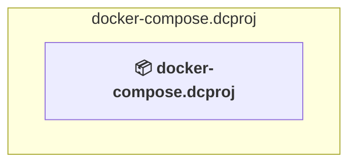
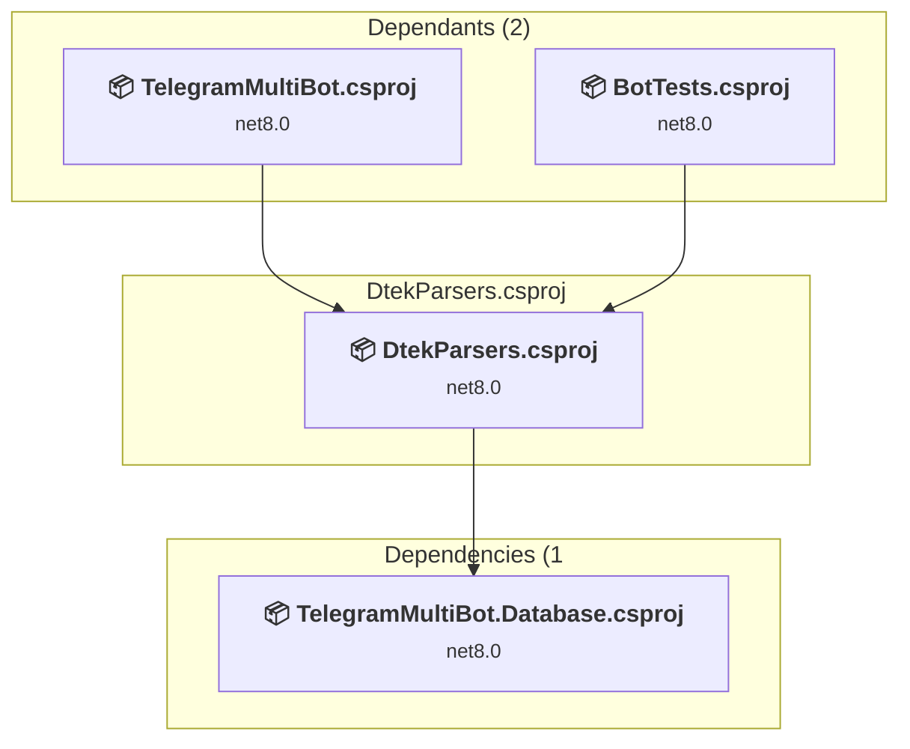
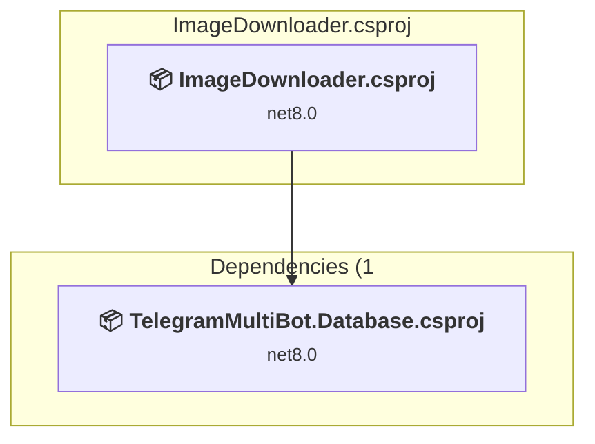
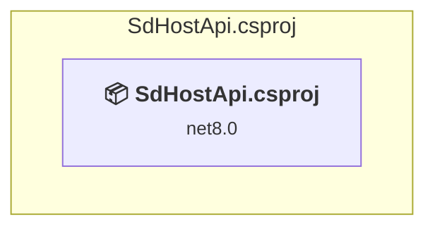
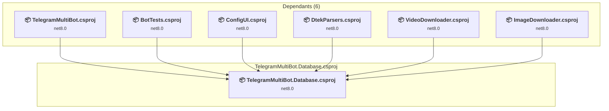
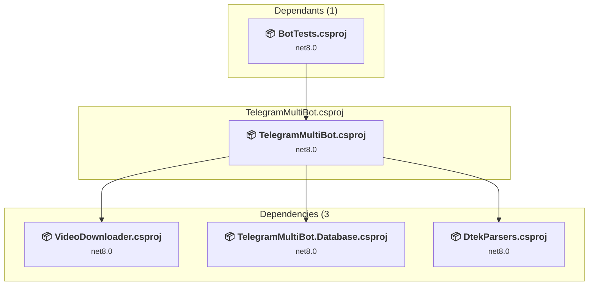
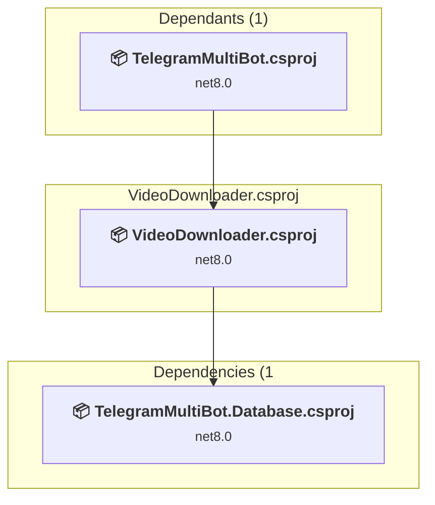

# Projects and dependencies analysis

This document provides a comprehensive overview of the projects and their dependencies in the context of upgrading to .NETCoreApp,Version=v10.0.

## Table of Contents

- [Executive Summary](#executive-Summary)
  - [Highlevel Metrics](#highlevel-metrics)
  - [Projects Compatibility](#projects-compatibility)
  - [Package Compatibility](#package-compatibility)
  - [API Compatibility](#api-compatibility)
- [Aggregate NuGet packages details](#aggregate-nuget-packages-details)
- [Top API Migration Challenges](#top-api-migration-challenges)
  - [Technologies and Features](#technologies-and-features)
  - [Most Frequent API Issues](#most-frequent-api-issues)
- [Projects Relationship Graph](#projects-relationship-graph)
- [Project Details](#project-details)

  - [BotTests\BotTests.csproj](#bottestsbottestscsproj)
  - [ConfigUI\ConfigUI.csproj](#configuiconfiguicsproj)
  - [docker-compose.dcproj](#docker-composedcproj)
  - [DtekParsers\DtekParsers.csproj](#dtekparsersdtekparserscsproj)
  - [E:\sources\ImageDownloader\ImageDownloader.csproj](#e:sourcesimagedownloaderimagedownloadercsproj)
  - [SdHostApi\SdHostApi.csproj](#sdhostapisdhostapicsproj)
  - [TelegramMultiBot.Database\TelegramMultiBot.Database.csproj](#telegrammultibotdatabasetelegrammultibotdatabasecsproj)
  - [TelegramMultiBot\TelegramMultiBot.csproj](#telegrammultibottelegrammultibotcsproj)
  - [VideoDownloader\VideoDownloader.csproj](#videodownloadervideodownloadercsproj)

## Executive Summary

### Highlevel Metrics

| Metric | Count | Status |
| :--- | :---: | :--- |
| Total Projects | 9 | 8 require upgrade |
| Total NuGet Packages | 37 | 18 need upgrade |
| Total Code Files | 334 |  |
| Total Code Files with Incidents | 32 |  |
| Total Lines of Code | 47036 |  |
| Total Number of Issues | 153 |  |
| Estimated LOC to modify | 119+ | at least 0,3% of codebase |

### Projects Compatibility

| Project | Target Framework | Difficulty | Package Issues | API Issues | Est. LOC Impact | Description |
| :--- | :---: | :---: | :---: | :---: | :---: | :--- |
| [BotTests\BotTests.csproj](#bottestsbottestscsproj) | net8.0 | 🟢 Low | 1 | 0 |  | DotNetCoreApp, Sdk Style = True |
| [ConfigUI\ConfigUI.csproj](#configuiconfiguicsproj) | net8.0 | 🟢 Low | 3 | 1 | 1+ | AspNetCore, Sdk Style = True |
| [docker-compose.dcproj](#docker-composedcproj) |  | ✅ None | 0 | 0 |  | DotNetCoreApp, Sdk Style = True |
| [DtekParsers\DtekParsers.csproj](#dtekparsersdtekparserscsproj) | net8.0 | 🟢 Low | 0 | 1 | 1+ | ClassLibrary, Sdk Style = True |
| [E:\sources\ImageDownloader\ImageDownloader.csproj](#e:sourcesimagedownloaderimagedownloadercsproj) | net8.0 | 🟢 Low | 0 | 0 |  | ClassLibrary, Sdk Style = True |
| [SdHostApi\SdHostApi.csproj](#sdhostapisdhostapicsproj) | net8.0 | 🟢 Low | 4 | 8 | 8+ | AspNetCore, Sdk Style = True |
| [TelegramMultiBot.Database\TelegramMultiBot.Database.csproj](#telegrammultibotdatabasetelegrammultibotdatabasecsproj) | net8.0 | 🟢 Low | 6 | 4 | 4+ | ClassLibrary, Sdk Style = True |
| [TelegramMultiBot\TelegramMultiBot.csproj](#telegrammultibottelegrammultibotcsproj) | net8.0 | 🟢 Low | 9 | 80 | 80+ | DotNetCoreApp, Sdk Style = True |
| [VideoDownloader\VideoDownloader.csproj](#videodownloadervideodownloadercsproj) | net8.0 | 🟢 Low | 3 | 25 | 25+ | ClassLibrary, Sdk Style = True |

### Package Compatibility

| Status | Count | Percentage |
| :--- | :---: | :---: |
| ✅ Compatible | 19 | 51,4% |
| ⚠️ Incompatible | 1 | 2,7% |
| 🔄 Upgrade Recommended | 17 | 45,9% |
| ***Total NuGet Packages*** | ***37*** | ***100%*** |

### API Compatibility

| Category | Count | Impact |
| :--- | :---: | :--- |
| 🔴 Binary Incompatible | 3 | High - Require code changes |
| 🟡 Source Incompatible | 23 | Medium - Needs re-compilation and potential conflicting API error fixing |
| 🔵 Behavioral change | 93 | Low - Behavioral changes that may require testing at runtime |
| ✅ Compatible | 69249 |  |
| ***Total APIs Analyzed*** | ***69368*** |  |

## Aggregate NuGet packages details

| Package | Current Version | Suggested Version | Projects | Description |
| :--- | :---: | :---: | :--- | :--- |
| AngleSharp | 1.4.0 |  | [TelegramMultiBot.csproj](#telegrammultibottelegrammultibotcsproj) | ✅Compatible |
| coverlet.collector | 8.0.1 |  | [BotTests.csproj](#bottestsbottestscsproj) | ✅Compatible |
| Cronos | 0.13.0 |  | [TelegramMultiBot.csproj](#telegrammultibottelegrammultibotcsproj) [TelegramMultiBot.Database.csproj](#telegrammultibotdatabasetelegrammultibotdatabasecsproj) | ✅Compatible |
| HtmlAgilityPack | 1.12.4 |  | [DtekParsers.csproj](#dtekparsersdtekparserscsproj) | ✅Compatible |
| Magick.NET.Core | 14.13.0 |  | [TelegramMultiBot.csproj](#telegrammultibottelegrammultibotcsproj) | ✅Compatible |
| Magick.NET-Q16-AnyCPU | 14.13.0 |  | [TelegramMultiBot.csproj](#telegrammultibottelegrammultibotcsproj) | ✅Compatible |
| Microsoft.AspNet.WebApi.Client | 6.0.0 |  | [TelegramMultiBot.csproj](#telegrammultibottelegrammultibotcsproj) | ✅Compatible |
| Microsoft.AspNetCore.OpenApi | 8.0.26 | 10.0.7 | [SdHostApi.csproj](#sdhostapisdhostapicsproj) | NuGet package upgrade is recommended |
| Microsoft.Build | 17.10.46 |  | [TelegramMultiBot.csproj](#telegrammultibottelegrammultibotcsproj) [TelegramMultiBot.Database.csproj](#telegrammultibotdatabasetelegrammultibotdatabasecsproj) | ✅Compatible |
| Microsoft.EntityFrameworkCore | 9.0.10 | 10.0.7 | [TelegramMultiBot.Database.csproj](#telegrammultibotdatabasetelegrammultibotdatabasecsproj) [VideoDownloader.csproj](#videodownloadervideodownloadercsproj) | NuGet package upgrade is recommended |
| Microsoft.EntityFrameworkCore.Design | 9.0.10 | 10.0.7 | [TelegramMultiBot.Database.csproj](#telegrammultibotdatabasetelegrammultibotdatabasecsproj) | NuGet package upgrade is recommended |
| Microsoft.EntityFrameworkCore.InMemory | 9.0.10 | 10.0.7 | [BotTests.csproj](#bottestsbottestscsproj) | NuGet package upgrade is recommended |
| Microsoft.EntityFrameworkCore.Proxies | 9.0.10 | 10.0.7 | [TelegramMultiBot.csproj](#telegrammultibottelegrammultibotcsproj) | NuGet package upgrade is recommended |
| Microsoft.EntityFrameworkCore.Relational | 9.0.10 | 10.0.7 | [TelegramMultiBot.csproj](#telegrammultibottelegrammultibotcsproj) | NuGet package upgrade is recommended |
| Microsoft.EntityFrameworkCore.Tools | 9.0.10 | 10.0.7 | [ConfigUI.csproj](#configuiconfiguicsproj) [TelegramMultiBot.Database.csproj](#telegrammultibotdatabasetelegrammultibotdatabasecsproj) | NuGet package upgrade is recommended |
| Microsoft.Extensions.Configuration | 9.0.10 | 10.0.7 | [TelegramMultiBot.csproj](#telegrammultibottelegrammultibotcsproj) [TelegramMultiBot.Database.csproj](#telegrammultibotdatabasetelegrammultibotdatabasecsproj) | NuGet package upgrade is recommended |
| Microsoft.Extensions.Configuration.EnvironmentVariables | 9.0.10 | 10.0.7 | [TelegramMultiBot.Database.csproj](#telegrammultibotdatabasetelegrammultibotdatabasecsproj) | NuGet package upgrade is recommended |
| Microsoft.Extensions.Configuration.Json | 9.0.10 | 10.0.7 | [TelegramMultiBot.csproj](#telegrammultibottelegrammultibotcsproj) [TelegramMultiBot.Database.csproj](#telegrammultibotdatabasetelegrammultibotdatabasecsproj) | NuGet package upgrade is recommended |
| Microsoft.Extensions.Configuration.UserSecrets | 9.0.10 | 10.0.7 | [TelegramMultiBot.csproj](#telegrammultibottelegrammultibotcsproj) | NuGet package upgrade is recommended |
| Microsoft.Extensions.DependencyInjection | 9.0.10 | 10.0.7 | [TelegramMultiBot.csproj](#telegrammultibottelegrammultibotcsproj) | NuGet package upgrade is recommended |
| Microsoft.Extensions.Hosting | 9.0.10 | 10.0.7 | [TelegramMultiBot.csproj](#telegrammultibottelegrammultibotcsproj) [VideoDownloader.csproj](#videodownloadervideodownloadercsproj) | NuGet package upgrade is recommended |
| Microsoft.Extensions.Hosting.WindowsServices | 9.0.10 | 10.0.7 | [SdHostApi.csproj](#sdhostapisdhostapicsproj) | NuGet package upgrade is recommended |
| Microsoft.Extensions.Http | 9.0.10 | 10.0.7 | [VideoDownloader.csproj](#videodownloadervideodownloadercsproj) | NuGet package upgrade is recommended |
| Microsoft.NET.Test.Sdk | 18.0.0 |  | [BotTests.csproj](#bottestsbottestscsproj) | ✅Compatible |
| Microsoft.VisualStudio.Azure.Containers.Tools.Targets | 1.22.1 |  | [ConfigUI.csproj](#configuiconfiguicsproj) [SdHostApi.csproj](#sdhostapisdhostapicsproj) [TelegramMultiBot.csproj](#telegrammultibottelegrammultibotcsproj) | ⚠️NuGet package is incompatible |
| Microsoft.VisualStudio.Web.CodeGeneration.Design | 9.0.0 | 10.0.2 | [ConfigUI.csproj](#configuiconfiguicsproj) | NuGet package upgrade is recommended |
| Moq | 4.20.72 |  | [BotTests.csproj](#bottestsbottestscsproj) | ✅Compatible |
| MSTest.TestAdapter | 4.0.1 |  | [BotTests.csproj](#bottestsbottestscsproj) | ✅Compatible |
| MSTest.TestFramework | 4.0.1 |  | [BotTests.csproj](#bottestsbottestscsproj) | ✅Compatible |
| Newtonsoft.Json | 13.0.4 |  | [DtekParsers.csproj](#dtekparsersdtekparserscsproj) [TelegramMultiBot.csproj](#telegrammultibottelegrammultibotcsproj) | ✅Compatible |
| Pomelo.EntityFrameworkCore.MySql | 9.0.0 |  | [TelegramMultiBot.Database.csproj](#telegrammultibotdatabasetelegrammultibotdatabasecsproj) | ✅Compatible |
| PuppeteerSharp | 20.2.4 |  | [DtekParsers.csproj](#dtekparsersdtekparserscsproj) | ✅Compatible |
| Swashbuckle.AspNetCore | 9.0.6 |  | [SdHostApi.csproj](#sdhostapisdhostapicsproj) | ✅Compatible |
| System.Diagnostics.PerformanceCounter | 9.0.10 | 10.0.7 | [SdHostApi.csproj](#sdhostapisdhostapicsproj) [TelegramMultiBot.csproj](#telegrammultibottelegrammultibotcsproj) | NuGet package upgrade is recommended |
| TagLibSharp | 2.3.0 |  | [VideoDownloader.csproj](#videodownloadervideodownloadercsproj) | ✅Compatible |
| Telegram.Bot | 22.9.6.2 |  | [ImageDownloader.csproj](#e:sourcesimagedownloaderimagedownloadercsproj) [TelegramMultiBot.csproj](#telegrammultibottelegrammultibotcsproj) [VideoDownloader.csproj](#videodownloadervideodownloadercsproj) | ✅Compatible |
| Telegram.Bot.Extensions.Markup | 1.0.2 |  | [TelegramMultiBot.csproj](#telegrammultibottelegrammultibotcsproj) | ✅Compatible |

## Top API Migration Challenges

### Technologies and Features

| Technology | Issues | Percentage | Migration Path |
| :--- | :---: | :---: | :--- |

### Most Frequent API Issues

| API | Count | Percentage | Category |
| :--- | :---: | :---: | :--- |
| T:System.Uri | 52 | 43,7% | Behavioral Change |
| T:System.Net.Http.HttpContent | 24 | 20,2% | Behavioral Change |
| M:System.Uri.#ctor(System.String) | 13 | 10,9% | Behavioral Change |
| M:System.TimeSpan.FromSeconds(System.Double) | 11 | 9,2% | Source Incompatible |
| M:Microsoft.Extensions.Configuration.ConfigurationBinder.GetValue''1(Microsoft.Extensions.Configuration.IConfiguration,System.String) | 3 | 2,5% | Binary Incompatible |
| M:System.TimeSpan.FromMilliseconds(System.Double) | 3 | 2,5% | Source Incompatible |
| M:System.Diagnostics.PerformanceCounter.NextValue | 2 | 1,7% | Source Incompatible |
| M:Microsoft.AspNetCore.Builder.ExceptionHandlerExtensions.UseExceptionHandler(Microsoft.AspNetCore.Builder.IApplicationBuilder,System.String) | 1 | 0,8% | Behavioral Change |
| P:System.Diagnostics.PerformanceCounter.InstanceName | 1 | 0,8% | Source Incompatible |
| P:System.Diagnostics.PerformanceCounter.CounterName | 1 | 0,8% | Source Incompatible |
| M:System.Diagnostics.PerformanceCounterCategory.GetCounters(System.String) | 1 | 0,8% | Source Incompatible |
| M:System.Diagnostics.PerformanceCounterCategory.GetInstanceNames | 1 | 0,8% | Source Incompatible |
| T:System.Diagnostics.PerformanceCounterCategory | 1 | 0,8% | Source Incompatible |
| M:System.Diagnostics.PerformanceCounterCategory.#ctor(System.String) | 1 | 0,8% | Source Incompatible |
| M:System.TimeSpan.FromMinutes(System.Double) | 1 | 0,8% | Source Incompatible |
| M:Microsoft.Extensions.Logging.ConsoleLoggerExtensions.AddConsole(Microsoft.Extensions.Logging.ILoggingBuilder) | 1 | 0,8% | Behavioral Change |
| T:Microsoft.Extensions.Hosting.HostBuilder | 1 | 0,8% | Behavioral Change |
| M:Microsoft.Extensions.DependencyInjection.HttpClientFactoryServiceCollectionExtensions.AddHttpClient(Microsoft.Extensions.DependencyInjection.IServiceCollection) | 1 | 0,8% | Behavioral Change |

## Projects Relationship Graph

Legend:
📦 SDK-style project
⚙️ Classic project

## Project Details

### BotTests\BotTests.csproj

#### Project Info

- **Current Target Framework:** net8.0
- **Proposed Target Framework:** net10.0
- **SDK-style**: True
- **Project Kind:** DotNetCoreApp
- **Dependencies**: 3
- **Dependants**: 0
- **Number of Files**: 14
- **Number of Files with Incidents**: 1
- **Lines of Code**: 1804
- **Estimated LOC to modify**: 0+ (at least 0,0% of the project)

#### Dependency Graph

Legend:
📦 SDK-style project
⚙️ Classic project

### API Compatibility

| Category | Count | Impact |
| :--- | :---: | :--- |
| 🔴 Binary Incompatible | 0 | High - Require code changes |
| 🟡 Source Incompatible | 0 | Medium - Needs re-compilation and potential conflicting API error fixing |
| 🔵 Behavioral change | 0 | Low - Behavioral changes that may require testing at runtime |
| ✅ Compatible | 1828 |  |
| ***Total APIs Analyzed*** | ***1828*** |  |

### ConfigUI\ConfigUI.csproj

#### Project Info

- **Current Target Framework:** net8.0
- **Proposed Target Framework:** net10.0
- **SDK-style**: True
- **Project Kind:** AspNetCore
- **Dependencies**: 1
- **Dependants**: 0
- **Number of Files**: 31
- **Number of Files with Incidents**: 2
- **Lines of Code**: 1288
- **Estimated LOC to modify**: 1+ (at least 0,1% of the project)

#### Dependency Graph

Legend:
📦 SDK-style project
⚙️ Classic project

### API Compatibility

| Category | Count | Impact |
| :--- | :---: | :--- |
| 🔴 Binary Incompatible | 0 | High - Require code changes |
| 🟡 Source Incompatible | 0 | Medium - Needs re-compilation and potential conflicting API error fixing |
| 🔵 Behavioral change | 1 | Low - Behavioral changes that may require testing at runtime |
| ✅ Compatible | 9791 |  |
| ***Total APIs Analyzed*** | ***9792*** |  |

### docker-compose.dcproj

#### Project Info

- **Current Target Framework:** ✅
- **SDK-style**: True
- **Project Kind:** DotNetCoreApp
- **Dependencies**: 0
- **Dependants**: 0
- **Number of Files**: 0
- **Lines of Code**: 0
- **Estimated LOC to modify**: 0+ (at least 0,0% of the project)

#### Dependency Graph

Legend:
📦 SDK-style project
⚙️ Classic project

### API Compatibility

| Category | Count | Impact |
| :--- | :---: | :--- |
| 🔴 Binary Incompatible | 0 | High - Require code changes |
| 🟡 Source Incompatible | 0 | Medium - Needs re-compilation and potential conflicting API error fixing |
| 🔵 Behavioral change | 0 | Low - Behavioral changes that may require testing at runtime |
| ✅ Compatible | 0 |  |
| ***Total APIs Analyzed*** | ***0*** |  |

### DtekParsers\DtekParsers.csproj

#### Project Info

- **Current Target Framework:** net8.0
- **Proposed Target Framework:** net10.0
- **SDK-style**: True
- **Project Kind:** ClassLibrary
- **Dependencies**: 1
- **Dependants**: 2
- **Number of Files**: 17
- **Number of Files with Incidents**: 2
- **Lines of Code**: 1200
- **Estimated LOC to modify**: 1+ (at least 0,1% of the project)

#### Dependency Graph

Legend:
📦 SDK-style project
⚙️ Classic project

### API Compatibility

| Category | Count | Impact |
| :--- | :---: | :--- |
| 🔴 Binary Incompatible | 0 | High - Require code changes |
| 🟡 Source Incompatible | 0 | Medium - Needs re-compilation and potential conflicting API error fixing |
| 🔵 Behavioral change | 1 | Low - Behavioral changes that may require testing at runtime |
| ✅ Compatible | 1288 |  |
| ***Total APIs Analyzed*** | ***1289*** |  |

### E:\sources\ImageDownloader\ImageDownloader.csproj

#### Project Info

- **Current Target Framework:** net8.0
- **Proposed Target Framework:** net10.0
- **SDK-style**: True
- **Project Kind:** ClassLibrary
- **Dependencies**: 1
- **Dependants**: 0
- **Number of Files**: 2
- **Number of Files with Incidents**: 1
- **Lines of Code**: 31
- **Estimated LOC to modify**: 0+ (at least 0,0% of the project)

#### Dependency Graph

Legend:
📦 SDK-style project
⚙️ Classic project

### API Compatibility

| Category | Count | Impact |
| :--- | :---: | :--- |
| 🔴 Binary Incompatible | 0 | High - Require code changes |
| 🟡 Source Incompatible | 0 | Medium - Needs re-compilation and potential conflicting API error fixing |
| 🔵 Behavioral change | 0 | Low - Behavioral changes that may require testing at runtime |
| ✅ Compatible | 20 |  |
| ***Total APIs Analyzed*** | ***20*** |  |

#### Project Package References

| Package | Type | Current Version | Suggested Version | Description |
| :--- | :---: | :---: | :---: | :--- |
| Telegram.Bot | Explicit | 22.9.6.2 |  | ✅Compatible |

### SdHostApi\SdHostApi.csproj

#### Project Info

- **Current Target Framework:** net8.0
- **Proposed Target Framework:** net10.0
- **SDK-style**: True
- **Project Kind:** AspNetCore
- **Dependencies**: 0
- **Dependants**: 0
- **Number of Files**: 4
- **Number of Files with Incidents**: 2
- **Lines of Code**: 84
- **Estimated LOC to modify**: 8+ (at least 9,5% of the project)

#### Dependency Graph

Legend:
📦 SDK-style project
⚙️ Classic project

### API Compatibility

| Category | Count | Impact |
| :--- | :---: | :--- |
| 🔴 Binary Incompatible | 0 | High - Require code changes |
| 🟡 Source Incompatible | 8 | Medium - Needs re-compilation and potential conflicting API error fixing |
| 🔵 Behavioral change | 0 | Low - Behavioral changes that may require testing at runtime |
| ✅ Compatible | 81 |  |
| ***Total APIs Analyzed*** | ***89*** |  |

### TelegramMultiBot.Database\TelegramMultiBot.Database.csproj

#### Project Info

- **Current Target Framework:** net8.0
- **Proposed Target Framework:** net10.0
- **SDK-style**: True
- **Project Kind:** ClassLibrary
- **Dependencies**: 0
- **Dependants**: 6
- **Number of Files**: 167
- **Number of Files with Incidents**: 2
- **Lines of Code**: 32938
- **Estimated LOC to modify**: 4+ (at least 0,0% of the project)

#### Dependency Graph

Legend:
📦 SDK-style project
⚙️ Classic project

### API Compatibility

| Category | Count | Impact |
| :--- | :---: | :--- |
| 🔴 Binary Incompatible | 0 | High - Require code changes |
| 🟡 Source Incompatible | 0 | Medium - Needs re-compilation and potential conflicting API error fixing |
| 🔵 Behavioral change | 4 | Low - Behavioral changes that may require testing at runtime |
| ✅ Compatible | 44791 |  |
| ***Total APIs Analyzed*** | ***44795*** |  |

### TelegramMultiBot\TelegramMultiBot.csproj

#### Project Info

- **Current Target Framework:** net8.0
- **Proposed Target Framework:** net10.0
- **SDK-style**: True
- **Project Kind:** DotNetCoreApp
- **Dependencies**: 3
- **Dependants**: 1
- **Number of Files**: 99
- **Number of Files with Incidents**: 17
- **Lines of Code**: 8710
- **Estimated LOC to modify**: 80+ (at least 0,9% of the project)

#### Dependency Graph

Legend:
📦 SDK-style project
⚙️ Classic project

### API Compatibility

| Category | Count | Impact |
| :--- | :---: | :--- |
| 🔴 Binary Incompatible | 3 | High - Require code changes |
| 🟡 Source Incompatible | 14 | Medium - Needs re-compilation and potential conflicting API error fixing |
| 🔵 Behavioral change | 63 | Low - Behavioral changes that may require testing at runtime |
| ✅ Compatible | 10253 |  |
| ***Total APIs Analyzed*** | ***10333*** |  |

### VideoDownloader\VideoDownloader.csproj

#### Project Info

- **Current Target Framework:** net8.0
- **Proposed Target Framework:** net10.0
- **SDK-style**: True
- **Project Kind:** ClassLibrary
- **Dependencies**: 1
- **Dependants**: 1
- **Number of Files**: 12
- **Number of Files with Incidents**: 5
- **Lines of Code**: 981
- **Estimated LOC to modify**: 25+ (at least 2,5% of the project)

#### Dependency Graph

Legend:
📦 SDK-style project
⚙️ Classic project

### API Compatibility

| Category | Count | Impact |
| :--- | :---: | :--- |
| 🔴 Binary Incompatible | 0 | High - Require code changes |
| 🟡 Source Incompatible | 1 | Medium - Needs re-compilation and potential conflicting API error fixing |
| 🔵 Behavioral change | 24 | Low - Behavioral changes that may require testing at runtime |
| ✅ Compatible | 1197 |  |
| ***Total APIs Analyzed*** | ***1222*** |  |

